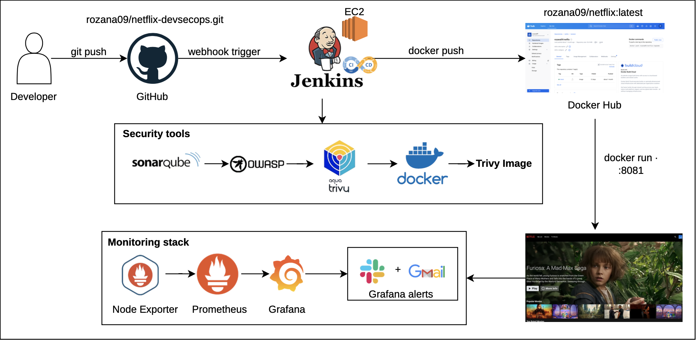
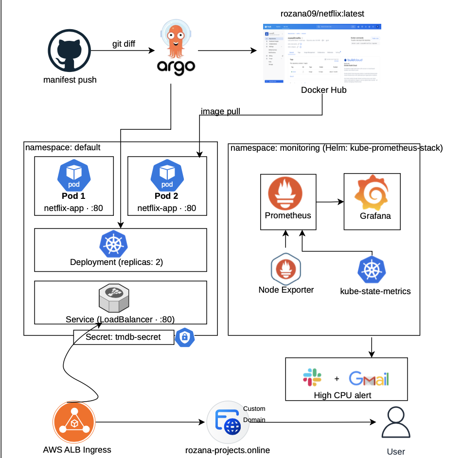

<div align="center">
  
  
  <br><br>
  
</div>

<br/>

<div align="center">
  
  <p align="center"><b>Netflix Clone — Live Preview</b></p>
</div>

<br/>

<div align="center">

# 🎬 Netflix Clone — DevSecOps on AWS

**A production-grade Netflix UI clone deployed on AWS using a full DevSecOps pipeline**

[](https://www.jenkins.io/)
[](https://www.docker.com/)
[](https://aws.amazon.com/eks/)
[](https://argoproj.github.io/)
[](https://www.sonarqube.org/)
[](https://trivy.dev/)
[](https://grafana.com/)
[](https://aws.amazon.com/)
[](LICENSE)

<br/>

> Built with React + Vite · Secured with SonarQube + Trivy + OWASP  
> Deployed on Amazon EKS · Monitored with Prometheus & Grafana · Delivered via ArgoCD GitOps

</div>

---

## 📑 Table of Contents

- [Overview](#-overview)
- [Architecture](#-architecture)
- [Tech Stack](#-tech-stack)
- [Part One — Jenkins CI/CD on EC2](#-part-one--jenkins-cicd-on-ec2)
  - [Phase 1 — Initial Setup](#phase-1--initial-setup)
  - [Phase 2 — Security Scanning](#phase-2--security-scanning)
  - [Phase 3 — Jenkins Pipeline](#phase-3--jenkins-pipeline)
  - [Phase 4 — Monitoring on EC2](#phase-4--monitoring-on-ec2)
  - [Phase 5 — Email Alerts](#phase-5--email-alerts)
  - [Phase 6 — Slack Alerts](#phase-6--slack-alerts)
- [Part Two — Kubernetes on EKS](#-part-two--kubernetes-on-eks)
  - [Prerequisites — Linux & macOS](#prerequisites--linux--macos)
  - [Deploy the App](#deploy-the-app)
  - [Monitoring on EKS](#monitoring-on-eks)
  - [ArgoCD GitOps](#argocd-gitops)
- [Jenkins Pipeline Stages](#-jenkins-pipeline-stages)
- [Grafana Dashboards](#-grafana-dashboards)
- [Port Reference](#-port-reference)
- [Project Structure](#-project-structure)
- [Deployment Checklist](#-deployment-checklist)
- [Full Documentation](#-full-documentation)
- [Author](#-author)

---

## 🔍 Overview

This project deploys a **Netflix UI clone** on AWS using a complete, production-grade DevSecOps workflow — from source code to a live, monitored, auto-deployed environment.

**What it demonstrates:**

- **Security-first CI/CD** — every build is scanned before it ships (SonarQube → OWASP → Trivy)
- **Infrastructure as Code** — EKS cluster provisioned with `eksctl`, manifests version-controlled in Git
- **GitOps delivery** — ArgoCD syncs cluster state directly from the repository; `git push` = deploy
- **Full observability** — Prometheus scrapes metrics, Grafana visualises them, alerts fire to Email & Slack

The live app is accessible at:
```
http://<your-loadbalancer-url>/browse
```

---

## 🏗️ Architecture

```
┌──────────────────────────────────────────────────────────────────────┐
│                        Developer / GitHub                            │
│         git push → github.com/rozana09/netflix-devsecops             │
└────────────────────────────┬─────────────────────────────────────────┘
                             │ webhook / poll
                             ▼
┌──────────────────────────────────────────────────────────────────────┐
│                    Jenkins (EC2 — t3.medium)                         │
│                                                                      │
│  Clean → Checkout → SonarQube → Quality Gate → npm install           │
│  → OWASP DC → Trivy FS → Docker Build & Push → Trivy Image → Deploy  │
└────────────────────────────┬─────────────────────────────────────────┘
                             │ docker push
                             ▼
                   ┌──────────────────────┐
                   │      Docker Hub      │
                   │  rozana09/netflix    │
                   │      :latest         │
                   └──────────┬───────────┘
                              │ image pull (ArgoCD sync)
                              ▼
┌──────────────────────────────────────────────────────────────────────┐
│                       Amazon EKS Cluster                             │
│                                                                      │
│  ┌──────────────────┐  ┌──────────────────┐  ┌──────────────────┐  │
│  │  Netflix App     │  │     ArgoCD        │  │   Monitoring     │  │
│  │  Deployment ×2   │  │  (GitOps Sync)    │  │   Namespace      │  │
│  │  LoadBalancer    │  │  watches ./k8s    │  │  Prometheus      │  │
│  │  /browse  ✅     │  │                   │  │  Grafana         │  │
│  └──────────────────┘  └──────────────────┘  │  Node Exporter   │  │
│                                               └──────────────────┘  │
└──────────────────────────────────────────────────────────────────────┘
                             │ alerts fire
                             ▼
              📧 Email (Gmail SMTP)  +  💬 Slack #alerts
```

---

## 🛠️ Tech Stack

| Category | Tool | Purpose |
|---|---|---|
| **Frontend** | React + Vite + NGINX | Netflix UI clone |
| **Containerisation** | Docker | Build & package the app |
| **Registry** | Docker Hub (`rozana09/netflix`) | Store container images |
| **CI/CD** | Jenkins (Java 21) | Automated build & deploy pipeline |
| **Code Quality** | SonarQube (Docker, port 9000) | Static code analysis |
| **Security** | Trivy | Container & filesystem vulnerability scanning |
| **Dependency Check** | OWASP Dependency Check | Known CVEs in npm packages |
| **Orchestration** | Kubernetes — Amazon EKS | Container orchestration |
| **GitOps** | ArgoCD | Declarative continuous delivery |
| **Metrics** | Prometheus + Node Exporter | Metrics collection |
| **Dashboards** | Grafana | Visualisation & alerting UI |
| **Notifications** | Gmail SMTP + Slack Webhooks | Alert delivery |
| **Cloud** | AWS (EC2, EKS, ALB) | Infrastructure |
| **IaC** | eksctl | EKS cluster provisioning |
| **Data Source** | TMDB API | Movie & TV show data |

---

## 📦 Part One — Jenkins CI/CD on EC2

### Phase 1 — Initial Setup

**EC2 Specifications:**

| Field | Value |
|---|---|
| OS | Ubuntu 22.04 LTS |
| Instance Type | t3.medium |
| Storage | 20 GB (expand to 30 GB for full stack) |
| Security Group | Port 22 (SSH) — open to your IP |

```bash
# Connect via SSH
ssh -i your-key.pem ubuntu@<your-public-ip>

# Update system
sudo apt-get update && sudo apt-get upgrade -y

# Clone the repository
git clone https://github.com/rozana09/netflix-devsecops.git
cd netflix-devsecops

# Install Docker
sudo apt-get install docker.io -y
sudo usermod -aG docker ubuntu
newgrp docker
sudo chmod 777 /var/run/docker.sock

# Build with TMDB API key
docker build --build-arg TMDB_V3_API_KEY=<your-api-key> -t netflix .
```

> **Get your TMDB API key:** [themoviedb.org](https://www.themoviedb.org) → Settings → API → Generate Key

---

### Phase 2 — Security Scanning

**SonarQube** — run as a Docker container:

```bash
docker run -d --name sonar -p 9000:9000 sonarqube:lts-community
docker logs -f sonar   # wait for: SonarQube is operational
```

Access at `http://<ec2-ip>:9000` — default login: `admin` / `admin`

Generate token: Profile → Security → Generate Token → type: **Global Analysis Token** → copy for Jenkins.

**Trivy** — filesystem & image scanner:

```bash
sudo apt-get install wget apt-transport-https gnupg lsb-release -y

curl -fsSL https://aquasecurity.github.io/trivy-repo/deb/public.key \
  | sudo tee /usr/share/keyrings/trivy.asc > /dev/null

echo "deb [signed-by=/usr/share/keyrings/trivy.asc] \
  https://aquasecurity.github.io/trivy-repo/deb jammy main" \
  | sudo tee /etc/apt/sources.list.d/trivy.list

sudo apt-get update && sudo apt-get install trivy -y
trivy --version

# Scan the image
trivy image netflix
```

---

### Phase 3 — Jenkins Pipeline

**Install Jenkins (Java 21):**

```bash
sudo apt update
sudo apt install openjdk-21-jdk -y
java -version   # Expected: OpenJDK Runtime Environment 21.x

sudo wget -O /usr/share/keyrings/jenkins-keyring.asc \
  https://pkg.jenkins.io/debian-stable/jenkins.io-2023.key

echo "deb [signed-by=/usr/share/keyrings/jenkins-keyring.asc] \
  https://pkg.jenkins.io/debian-stable binary/" \
  | sudo tee /etc/apt/sources.list.d/jenkins.list > /dev/null

sudo apt update && sudo apt install jenkins -y
sudo systemctl start jenkins && sudo systemctl enable jenkins
```

> Ensure **port 8080** is open in your EC2 Security Group.

**Unlock Jenkins:** `http://<ec2-ip>:8080`

```bash
sudo cat /var/lib/jenkins/secrets/initialAdminPassword
```

Select **Install suggested plugins** → create your admin user.

**Required plugins** (Manage Jenkins → Plugins → Available):

| Category | Plugins |
|---|---|
| Build Tools | NodeJS, Eclipse Temurin Installer, JDK |
| Code Quality | SonarQube Scanner |
| Security | OWASP Dependency Check |
| Containers | Docker, Docker Commons, Docker Pipeline, Docker API, docker-build-step |
| Notifications | Email Extension Template |

**Global Tool Configuration** (Manage Jenkins → Tools):

| Tool | Name | Notes |
|---|---|---|
| JDK | `jdk21` | Uncheck "Install automatically" · set `JAVA_HOME=/usr/lib/jvm/java-21-openjdk-amd64` |
| NodeJS | `node16` | Install automatically ✔ |
| SonarQube Scanner | `sonar-scanner` | Install automatically ✔ |
| OWASP DC | `DP-Check` | Install automatically ✔ |

**Connect SonarQube to Jenkins** (Manage Jenkins → Configure System → SonarQube servers):

| Field | Value |
|---|---|
| Name | `sonar-server` ← must exactly match pipeline |
| Server URL | `http://<your-ec2-ip>:9000` |
| Token Kind | Secret Text |
| Token ID | `Sonar-token` |

**Configure SonarQube Webhook** (in SonarQube UI → Administration → Configuration → Webhooks → Create):

```
Name: jenkins
URL:  http://<JENKINS-IP>:8080/sonarqube-webhook/
```

**Fix Docker permissions for Jenkins:**

```bash
sudo usermod -aG docker jenkins
sudo systemctl restart jenkins
sudo chmod 777 /var/run/docker.sock
```

**Add Docker Hub credentials** (Manage Jenkins → Credentials → Global → Add):

| Field | Value |
|---|---|
| Kind | Username with password |
| Username | your Docker Hub username |
| Password | Docker Hub password or access token |
| ID | `docker` ← **must exactly match the pipeline** |

**Jenkinsfile:**

```groovy
pipeline {
    agent any
    tools {
        jdk    'jdk21'
        nodejs 'node16'
    }
    environment {
        SCANNER_HOME = tool 'sonar-scanner'
    }
    stages {

        stage('Clean Workspace') {
            steps { cleanWs() }
        }

        stage('Checkout from Git') {
            steps {
                git branch: 'main',
                    url: 'https://github.com/rozana09/netflix-devsecops.git'
            }
        }

        stage('SonarQube Analysis') {
            steps {
                withSonarQubeEnv('sonar-server') {
                    sh """
                    $SCANNER_HOME/bin/sonar-scanner \
                      -Dsonar.projectName=Netflix \
                      -Dsonar.projectKey=Netflix
                    """
                }
            }
        }

        stage('Quality Gate') {
            steps {
                script {
                    waitForQualityGate abortPipeline: false,
                                       credentialsId: 'Sonar-token'
                }
            }
        }

        stage('Install Dependencies') {
            steps { sh 'npm install' }
        }

        stage('OWASP Dependency Check') {
            steps {
                dependencyCheck additionalArguments: '--scan ./ --disableYarnAudit --disableNodeAudit',
                                odcInstallation: 'DP-Check'
                dependencyCheckPublisher pattern: '**/dependency-check-report.xml'
            }
        }

        stage('Trivy File System Scan') {
            steps { sh 'trivy fs . > trivyfs.txt' }
        }

        stage('Docker Build & Push') {
            steps {
                script {
                    withDockerRegistry(credentialsId: 'docker', toolName: 'docker') {
                        sh '''
                        docker build --build-arg TMDB_V3_API_KEY=<your-api-key> -t netflix .
                        docker tag netflix rozana09/netflix:latest
                        docker push rozana09/netflix:latest
                        '''
                    }
                }
            }
        }

        stage('Trivy Image Scan') {
            steps { sh 'trivy image rozana09/netflix:latest > trivyimage.txt' }
        }

        stage('Deploy to Container') {
            steps {
                sh 'docker run -d --name netflix -p 8081:80 rozana09/netflix:latest'
            }
        }
    }
}
```

> **If you get a docker login failed error:**
> ```bash
> sudo usermod -aG docker jenkins
> sudo systemctl restart jenkins
> ```

---

### Phase 4 — Monitoring on EC2

**Install Prometheus:**

```bash
sudo useradd --system --no-create-home --shell /bin/false prometheus

wget https://github.com/prometheus/prometheus/releases/download/v2.47.1/prometheus-2.47.1.linux-amd64.tar.gz
tar -xvf prometheus-2.47.1.linux-amd64.tar.gz
cd prometheus-2.47.1.linux-amd64/

sudo mkdir -p /data /etc/prometheus
sudo mv prometheus promtool /usr/local/bin/
sudo mv consoles/ console_libraries/ /etc/prometheus/
sudo mv prometheus.yml /etc/prometheus/prometheus.yml
sudo chown -R prometheus:prometheus /etc/prometheus/ /data/
```

Create `/etc/systemd/system/prometheus.service`:

```ini
[Unit]
Description=Prometheus
Wants=network-online.target
After=network-online.target
StartLimitIntervalSec=500
StartLimitBurst=5

[Service]
User=prometheus
Group=prometheus
Type=simple
Restart=on-failure
RestartSec=5s
ExecStart=/usr/local/bin/prometheus \
  --config.file=/etc/prometheus/prometheus.yml \
  --storage.tsdb.path=/data \
  --web.console.templates=/etc/prometheus/consoles \
  --web.console.libraries=/etc/prometheus/console_libraries \
  --web.listen-address=0.0.0.0:9090 \
  --web.enable-lifecycle

[Install]
WantedBy=multi-user.target
```

```bash
sudo systemctl enable prometheus && sudo systemctl start prometheus
sudo systemctl status prometheus
```

> Access at `http://<ec2-ip>:9090` — ensure port 9090 is open in your Security Group.

**Install Node Exporter:**

```bash
sudo useradd --system --no-create-home --shell /bin/false node_exporter

wget https://github.com/prometheus/node_exporter/releases/download/v1.6.1/node_exporter-1.6.1.linux-amd64.tar.gz
tar -xvf node_exporter-1.6.1.linux-amd64.tar.gz
sudo mv node_exporter-1.6.1.linux-amd64/node_exporter /usr/local/bin/
rm -rf node_exporter*
```

Create `/etc/systemd/system/node_exporter.service`:

```ini
[Unit]
Description=Node Exporter
Wants=network-online.target
After=network-online.target
StartLimitIntervalSec=500
StartLimitBurst=5

[Service]
User=node_exporter
Group=node_exporter
Type=simple
Restart=on-failure
RestartSec=5s
ExecStart=/usr/local/bin/node_exporter --collector.logind

[Install]
WantedBy=multi-user.target
```

```bash
sudo systemctl enable node_exporter && sudo systemctl start node_exporter
sudo systemctl status node_exporter
```

> Verify at `http://<ec2-ip>:9100/metrics` — ensure port 9100 is open.

**Configure Prometheus scrape targets** (`sudo nano /etc/prometheus/prometheus.yml`):

```yaml
global:
  scrape_interval: 15s

scrape_configs:
  - job_name: 'node_exporter'
    static_configs:
      - targets: ['localhost:9100']

  - job_name: 'jenkins'
    metrics_path: '/prometheus'
    static_configs:
      - targets: ['<your-jenkins-ip>:8080']
```

```bash
promtool check config /etc/prometheus/prometheus.yml
curl -X POST http://localhost:9090/-/reload
```

> Verify targets at `http://<ec2-ip>:9090` → Status → Targets
>
> **If Jenkins target shows DOWN:** Install the **Prometheus Metrics Plugin** in Jenkins (Manage Jenkins → Plugins → Available → search "Prometheus Metrics") then restart Jenkins. Also enable anonymous read access under Manage Jenkins → Configure Global Security.

**Install Grafana:**

```bash
sudo apt-get install -y apt-transport-https software-properties-common
wget -q -O - https://packages.grafana.com/gpg.key | sudo apt-key add -
echo "deb https://packages.grafana.com/oss/deb stable main" \
  | sudo tee -a /etc/apt/sources.list.d/grafana.list

sudo apt-get update && sudo apt-get install grafana -y
sudo systemctl enable grafana-server && sudo systemctl start grafana-server
```

> Access at `http://<ec2-ip>:3000` — default login: `admin` / `admin`  
> Ensure **port 3000** is open in your Security Group.

Add Prometheus data source: Connections → Data Sources → Add → Prometheus → URL: `http://localhost:9090` → Save & Test.

**Verify connection:** Explore → select Prometheus → run query `up` → you should see `node_exporter = 1` and `jenkins = 1`.

**Import Node Exporter dashboard:** Dashboards → Import → ID: `1860` → select Prometheus → Import.

---

### Phase 5 — Email Alerts

```bash
sudo nano /etc/grafana/grafana.ini
```

Locate the `[smtp]` section and configure:

```ini
[smtp]
enabled      = true
host         = smtp.gmail.com:587
user         = your-email@gmail.com
password     = your-google-app-password
from_address = your-email@gmail.com
from_name    = Grafana Alerts
```

```bash
sudo systemctl restart grafana-server
```

> **Gmail requires an App Password** — not your regular password.  
> Google Account → Security → 2-Step Verification → App Passwords → Generate.

In Grafana: Alerting → Contact points → New contact point:

| Field | Value |
|---|---|
| Name | `email-alert` |
| Type | Email |
| Address | your email address |

Click **Test** to confirm delivery, then save.

**CPU Alert Rule** (Alerting → Alert rules → New alert rule):

```promql
100 - (avg(rate(node_cpu_seconds_total{mode="idle"}[2m])) * 100)
```

| Setting | Value |
|---|---|
| Condition | WHEN last() IS ABOVE 80 |
| Evaluation | Every 1m \| For 2m |
| Alert Name | High CPU Alert |
| Contact Point | email-alert |

**Test the alert:**

```bash
yes > /dev/null &    # spike CPU usage
# Wait ~2 min → Grafana Alerting → Pending → FIRING
# Check inbox for 'High CPU Alert' email
killall yes          # stop the spike
```

---

### Phase 6 — Slack Alerts

1. Create a Slack workspace at [slack.com/get-started](https://slack.com/get-started) with a `#alerts` channel.
2. Go to [api.slack.com/apps](https://api.slack.com/apps) → Create New App → From scratch → name: `grafana-alerts`.
3. Incoming Webhooks → toggle **ON** → Add New Webhook → select `#alerts` → Allow.
4. Copy the webhook URL: `https://hooks.slack.com/services/T.../B.../...`

In Grafana: Alerting → Contact points → New contact point:

| Field | Value |
|---|---|
| Name | `slack-alert` |
| Type | Slack |
| Webhook URL | paste from step 4 |

Click **Test** — confirm message appears in `#alerts`.

Edit the High CPU Alert rule → add `slack-alert` alongside `email-alert`.

**Test with stress tool:**

```bash
sudo apt install stress -y
stress --cpu 2 --timeout 120
# Check Grafana alert rules + #alerts Slack channel
```

---

## ☸️ Part Two — Kubernetes on EKS

### Prerequisites — Linux & macOS

> **macOS — install Homebrew first if not already installed:**
> ```bash
> /bin/bash -c "$(curl -fsSL https://raw.githubusercontent.com/Homebrew/install/HEAD/install.sh)"
> ```
> Apple Silicon (M1/M2/M3) only — add to PATH after install:
> ```bash
> echo 'eval "$(/opt/homebrew/bin/brew shellenv)"' >> ~/.zprofile
> eval "$(/opt/homebrew/bin/brew shellenv)"
> ```

| Tool | 🐧 Linux / Ubuntu | 🍎 macOS (Homebrew) |
|---|---|---|
| **AWS CLI** | `curl` + unzip installer | `brew install awscli` |
| **kubectl** | `curl` binary + chmod + mv | `brew install kubectl` |
| **eksctl** | `curl` tar.gz (linux_amd64) | `brew tap weaveworks/tap && brew install eksctl` |
| **Helm** | `get-helm-3` script | `brew install helm` |
| **ArgoCD CLI** | `curl` binary + install | `brew install argocd` |
| **Docker** | `apt-get install docker.io` | Docker Desktop (`brew install --cask docker`) |

**Configure AWS credentials** (identical on both OS):

```bash
aws configure
# AWS Access Key ID, Secret Access Key, region: us-east-1, output: json
aws sts get-caller-identity   # verify
```

**Create EKS cluster** (takes 15–20 min):

```bash
eksctl create cluster \
  --name netflix-cluster \
  --region us-east-1 \
  --nodegroup-name standard-workers \
  --node-type t3.medium \
  --nodes 2 --nodes-min 1 --nodes-max 3 \
  --managed

aws eks update-kubeconfig --region us-east-1 --name netflix-cluster
kubectl get nodes   # Expected: 2 nodes, STATUS = Ready
```

**Build and push Docker image:**

```bash
docker build -t rozana09/netflix:latest .
docker login
docker push rozana09/netflix:latest
```

---

### Deploy the App

```bash
# Create TMDB secret — never hardcode in manifests
kubectl create secret generic tmdb-secret \
  --from-literal=api-key=<your-tmdb-api-key>

# Apply manifests
kubectl apply -f k8s/deployment.yaml
kubectl apply -f k8s/service.yaml

# Watch pods start up
kubectl get pods -w

# Get public URL (~2 min to provision)
kubectl get svc netflix-service
```

Access: `http://<EXTERNAL-IP>/browse`

> A **403 on `/assets/`** is normal — NGINX blocks directory listing by default. Individual asset files load fine and the app works correctly.

---

### Monitoring on EKS

```bash
helm repo add prometheus-community https://prometheus-community.github.io/helm-charts
helm repo update

kubectl create namespace monitoring

helm install prometheus prometheus-community/kube-prometheus-stack \
  --namespace monitoring \
  --set prometheus.prometheusSpec.serviceMonitorSelectorNilUsesHelmValues=false \
  --set grafana.adminPassword='YourStrongPassword'

kubectl get pods -n monitoring   # wait for all Running
```

**Access Grafana:**

```bash
# Port-forward (local access)
kubectl port-forward svc/prometheus-grafana -n monitoring 3000:80

# OR expose publicly
kubectl patch svc prometheus-grafana -n monitoring \
  -p '{"spec":{"type":"LoadBalancer"}}'
```

**Import dashboards** (Dashboards → Import → enter ID → select Prometheus → Import):

| ID | Dashboard |
|---|---|
| `1860` | Node Exporter Full — CPU, memory, disk, network |
| `3119` | Kubernetes Cluster Overview |
| `6417` | Kubernetes Pod Resources |
| `315` | Kubernetes Cluster Monitoring |

---

### ArgoCD GitOps

```bash
kubectl create namespace argocd

kubectl apply -n argocd \
  -f https://raw.githubusercontent.com/argoproj/argo-cd/stable/manifests/install.yaml

kubectl get pods -n argocd -w   # wait for all Running

# Get initial admin password
kubectl get secret argocd-initial-admin-secret -n argocd \
  -o jsonpath='{.data.password}' | base64 -d

# Access UI via port-forward
kubectl port-forward svc/argocd-server -n argocd 8080:443
# Open: https://localhost:8080  (username: admin)
```

> Change the default password immediately after first login.

**Create the ArgoCD Application** (Settings → Repositories → Connect → then New App):

| Setting | Value |
|---|---|
| Application Name | `netflix-app` |
| Project | `default` |
| Sync Policy | Automatic — Self-Heal + Prune ✔ |
| Repository URL | `https://github.com/rozana09/netflix-devsecops.git` |
| Revision | `main` |
| Path | `./k8s` |
| Cluster URL | `https://kubernetes.default.svc` |
| Namespace | `default` |

```bash
argocd app get netflix-app
# Expected: Health = Healthy  |  Sync = Synced
```

> From this point, **`git push` = deploy**. ArgoCD detects manifest changes within ~3 minutes and triggers a rolling update automatically — no manual `kubectl apply` needed.

---

## 🔄 Jenkins Pipeline Stages

```
┌──────────────────────────┬──────────────────────┬──────────────────────────┐
│  Stage                   │  Tool                │  Output                  │
├──────────────────────────┼──────────────────────┼──────────────────────────┤
│  Clean Workspace         │  Jenkins             │  Fresh build directory   │
│  Checkout                │  Git                 │  Source code             │
│  SonarQube Analysis      │  SonarQube Scanner   │  Quality report          │
│  Quality Gate            │  SonarQube           │  Pass / Fail             │
│  Install Dependencies    │  npm                 │  node_modules            │
│  OWASP Dependency Check  │  OWASP DC            │  dependency-check-report │
│  Trivy FS Scan           │  Trivy               │  trivyfs.txt             │
│  Docker Build & Push     │  Docker              │  rozana09/netflix:latest │
│  Trivy Image Scan        │  Trivy               │  trivyimage.txt          │
│  Deploy to Container     │  Docker              │  Running on port 8081    │
└──────────────────────────┴──────────────────────┴──────────────────────────┘
```

---

## 📊 Grafana Dashboards

| ID | Dashboard | Shows |
|---|---|---|
| `1860` | Node Exporter Full | CPU, memory, disk, network per node |
| `3119` | Kubernetes Overview | Pod and deployment health |
| `6417` | Pod Resources | Per-pod resource usage |
| `315` | Cluster Monitoring | Cluster-wide summary |

---

## 🔌 Port Reference

| Port | Service | Part | Notes |
|---|---|---|---|
| 22 | SSH | Part 1 | EC2 access |
| 8080 | Jenkins | Part 1 | CI/CD dashboard |
| 8081 | Netflix App | Part 1 | Deployed Docker container |
| 9000 | SonarQube | Part 1 | Code quality analysis |
| 9090 | Prometheus | Parts 1 & 2 | Metrics collection |
| 9100 | Node Exporter | Parts 1 & 2 | System metrics endpoint |
| 3000 | Grafana | Parts 1 & 2 | Monitoring dashboards |
| 80 | Netflix App (EKS) | Part 2 | LoadBalancer EXTERNAL-IP |
| 443 | ArgoCD UI | Part 2 | Port-forward or LoadBalancer |

---

## 📁 Project Structure

```
netflix-devsecops/
├── public/
│   └── assets/                  # App assets + banner images
├── src/                         # React source code
│   ├── components/              # UI components
│   ├── pages/                   # Route pages (/browse etc.)
│   └── main.jsx                 # App entry point
├── k8s/                         # Kubernetes manifests
│   ├── deployment.yaml          # Deployment + Service
│   └── ingress.yaml             # ALB Ingress (optional)
├── docs/                        # Full documentation PDF
├── Dockerfile                   # Multi-stage Docker build
├── vite.config.js               # Vite config — base: "/"
├── Jenkinsfile                  # Jenkins pipeline definition
└── README.md
```

---

## ✅ Deployment Checklist

**Part One — EC2 / Jenkins**
- [ ] EC2 running, SSH accessible
- [ ] Docker installed, Netflix image builds with TMDB key
- [ ] SonarQube accessible at `:9000`, token generated
- [ ] Jenkins accessible at `:8080`, all plugins installed
- [ ] SonarQube webhook configured → Jenkins
- [ ] Docker Hub credentials set with ID `docker`
- [ ] Jenkins pipeline runs all 10 stages — no failures
- [ ] Prometheus targets UP at `:9090` → Status → Targets
- [ ] Grafana dashboard 1860 shows live metrics
- [ ] Email alert test → email received in inbox
- [ ] Slack alert test → message in `#alerts` channel

**Part Two — EKS / Kubernetes**
- [ ] `kubectl get nodes` → all nodes **Ready**
- [ ] `kubectl get pods` → all pods **Running**, 0 restarts
- [ ] App loads at `http://<EXTERNAL-IP>/browse`
- [ ] Prometheus targets all **UP** in monitoring namespace
- [ ] Grafana dashboards 1860, 3119, 6417, 315 imported
- [ ] ArgoCD app status → **Healthy + Synced**
- [ ] GitOps loop tested — git push triggers auto-deploy within 3 min

---

## 📖 Full Documentation

The complete step-by-step technical guide (57 pages) covering every phase in detail:

📄 **[Netflix DevSecOps Engineering Project — Full Documentation](./docs/Netflix-DevSecOps-AWS-Kubernetes-Document.pdf)**

---

## 👩‍💻 Author

**Rozana**
- GitHub: [@rozana09](https://github.com/rozana09)
- Repo: [netflix-devsecops](https://github.com/rozana09/netflix-devsecops)

---

<div align="center">

Made with ❤️ as a DevSecOps engineering project

⭐ **Star this repo if you found it helpful!**

</div>
